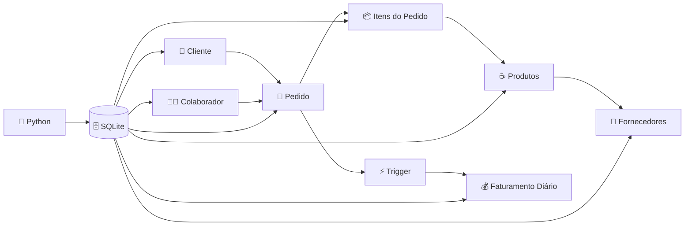
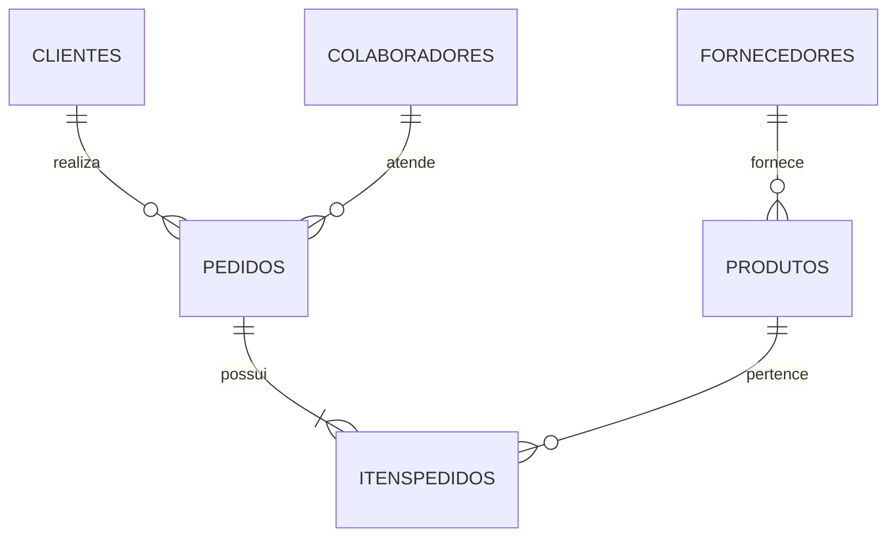
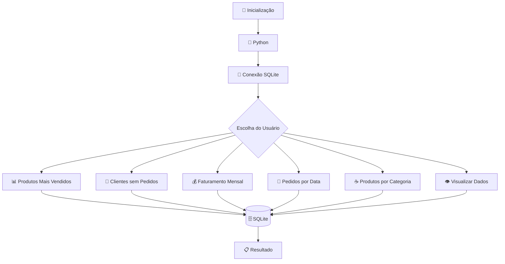
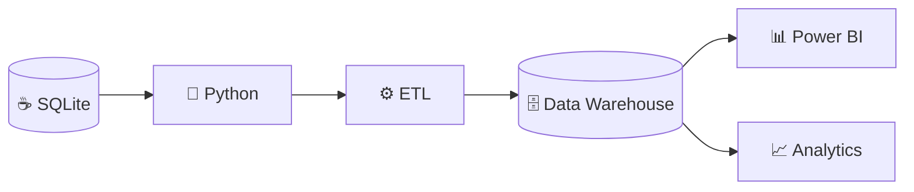

<div align="center">

# ☕ COFFEE SHOP DATABASE

### `SQL • SQLite • Python • Database Management`

<br>


<br>


<br>

> **From coffee orders to structured data.**

</div>

---

# ☕ Sobre o Projeto

O **Coffee Shop Management System** é um projeto de banco de dados relacional desenvolvido com **SQLite**, simulando a operação de uma cafeteria.

O sistema foi projetado para controlar dados relacionados a:

`Clientes` • `Produtos` • `Pedidos` • `Itens` • `Colaboradores` • `Fornecedores` • `Faturamento`

Além do armazenamento das informações, o projeto utiliza **SQL para transformar os dados operacionais em informações úteis para análise**.

Também foi desenvolvida uma aplicação em **Python** responsável por consultar o banco de dados através de um menu interativo.

---

# ⚡ Arquitetura do Sistema



---

# 🗄️ Modelo do Banco

```text
COFFEE SHOP DATABASE
│
├── 👤 clientes
│
├── ☕ produtos
│
├── 🛒 pedidos
│
├── 📦 itenspedidos
│
├── 👨‍💼 colaboradores
│
├── 🚚 fornecedores
│
└── 💰 faturamentodiario
```

---

# 🔗 Relacionamentos



---

# 🧠 Conceitos Aplicados

```text
SQL
 │
 ├── SELECT
 ├── WHERE
 ├── JOIN
 ├── GROUP BY
 ├── HAVING
 ├── ORDER BY
 ├── UNION
 ├── SUBQUERY
 ├── SUM
 ├── AVG
 └── COUNT

DATABASE
 │
 ├── Primary Keys
 ├── Foreign Keys
 ├── Normalização
 ├── Integridade Referencial
 ├── Views
 └── Triggers

PYTHON
 │
 ├── SQLite Connection
 ├── Queries
 ├── Menu Interativo
 └── Manipulação de Dados
```

---

# ⚙️ Fluxo da Aplicação



---

# 🐍 Aplicação Python

O arquivo:

```text
Python.py
```

permite interagir com o banco de dados sem precisar escrever consultas manualmente.

Exemplo do menu:

```text
╔════════════════════════════════════╗
║       ☕ COFFEE SHOP SYSTEM       ║
╠════════════════════════════════════╣
║                                    ║
║  [1] Produtos mais vendidos        ║
║  [2] Clientes sem pedidos          ║
║  [3] Faturamento mensal            ║
║  [4] Pedidos por data              ║
║  [5] Produtos por categoria        ║
║  [6] Visualizar banco              ║
║                                    ║
║  [0] Sair                          ║
║                                    ║
╚════════════════════════════════════╝
```

---

# 🔌 Exemplo de Integração Python + SQLite

```python
import sqlite3

conexao = sqlite3.connect("cafeteria.db")

cursor = conexao.cursor()

cursor.execute("""
    SELECT
        p.nome,
        SUM(ip.quantidade) AS quantidade_vendida
    FROM itenspedidos ip
    INNER JOIN produtos p
        ON ip.idproduto = p.idproduto
    GROUP BY p.nome
    ORDER BY quantidade_vendida DESC;
""")

resultados = cursor.fetchall()

for produto in resultados:
    print(produto)

conexao.close()
```

Esse tipo de integração permite que a aplicação Python consulte dinamicamente as informações armazenadas no banco.

---

# 🔥 Consultas SQL

## ☕ Produtos mais vendidos

```sql
SELECT
    p.nome,
    SUM(ip.quantidade) AS quantidade_vendida
FROM itenspedidos ip

INNER JOIN produtos p
    ON ip.idproduto = p.idproduto

GROUP BY p.nome

ORDER BY quantidade_vendida DESC;
```

---

## 💰 Faturamento por dia

```sql
SELECT
    data,
    SUM(valor) AS faturamento
FROM faturamentodiario

GROUP BY data

ORDER BY data;
```

---

## 👤 Clientes sem pedidos

```sql
SELECT
    c.nome
FROM clientes c

LEFT JOIN pedidos p
    ON c.idcliente = p.idcliente

WHERE p.idpedido IS NULL;
```

---

## 📈 Produtos acima da média de preço

```sql
SELECT
    nome,
    preco
FROM produtos

WHERE preco > (
    SELECT AVG(preco)
    FROM produtos
)

ORDER BY preco DESC;
```

---

# ⚡ Trigger de Faturamento

Uma das automações implementadas no projeto utiliza **Trigger**.

Quando um novo pedido é inserido, o banco pode atualizar automaticamente o controle financeiro.

```text
NOVO PEDIDO
     │
     ▼
┌──────────────┐
│   TRIGGER    │
└──────────────┘
     │
     ▼
Cálculo do valor
     │
     ▼
💰 FATURAMENTO DIÁRIO
```

Exemplo estrutural:

```sql
CREATE TRIGGER atualizar_faturamento

AFTER INSERT ON pedidos

BEGIN

    INSERT INTO faturamentodiario (
        data,
        valor
    )

    VALUES (
        NEW.data,
        NEW.valor_total
    );

END;
```

---

# 👁️ Views

O projeto utiliza Views para abstrair consultas mais complexas.

```text
DATABASE
   │
   ├── viewclientes
   │
   ├── ViewValorTotalPedido
   │
   ├── ViewItensPedidoDetalhado
   │
   ├── ViewProdutosFornecedores
   │
   ├── ViewEstoqueBaixo
   │
   └── ViewPedidosColaboradores
```

Por exemplo:

```sql
SELECT *
FROM ViewProdutosFornecedores;
```

Em vez de reconstruir toda a consulta com JOINs sempre que necessário.

---

<details>

<summary><b>🔎 Exemplo de View SQL</b></summary>

<br>

```sql
CREATE VIEW ViewProdutosFornecedores AS

SELECT
    p.idproduto,
    p.nome AS produto,
    p.preco,
    f.nome AS fornecedor

FROM produtos p

INNER JOIN fornecedores f
    ON p.idfornecedor = f.idfornecedor;
```

</details>

---

# 📊 Tipos de Análises

O banco permite responder perguntas como:

```text
┌─────────────────────────────────────────────┐
│                 BUSINESS DATA               │
├─────────────────────────────────────────────┤
│                                             │
│  ☕ Quais produtos vendem mais?             │
│                                             │
│  👤 Quais clientes nunca compraram?         │
│                                             │
│  💰 Qual foi o faturamento mensal?          │
│                                             │
│  📦 Quais produtos estão com estoque baixo? │
│                                             │
│  👨‍💼 Qual colaborador atendeu cada pedido? │
│                                             │
│  🚚 Quem fornece cada produto?              │
│                                             │
│  📈 Quais produtos custam acima da média?   │
│                                             │
└─────────────────────────────────────────────┘
```

---

# 📂 Estrutura do Projeto

```text
coffee-shop-database/
│
├── 📂 database/
│   │
│   └── cafeteria.db
│
├── 📂 sql/
│   │
│   ├── criando_tabelas.sql
│   ├── inserindo_dados.sql
│   ├── inserindo_dados2.sql
│   ├── inserindo_dados3.sql
│   ├── criando_views.sql
│   └── criando_trigger.sql
│
├── 🐍 Python.py
│
├── 📄 README.md
│
└── 📄 requirements.txt
```

---

# 🚀 Executando o Projeto

### Clone o repositório

```bash
git clone URL_DO_REPOSITORIO
```

Entre na pasta:

```bash
cd coffee-shop-database
```

Execute a aplicação:

```bash
python Python.py
```

---

# 🧰 Tecnologias

<div align="center">


<br><br>

`Python` • `SQLite` • `SQL` • `Git` • `GitHub`

</div>

---

# 📚 Aprendizado

Este projeto foi desenvolvido para consolidar conhecimentos relacionados a bancos de dados e desenvolvimento de aplicações.

```text
DADOS
  ↓
MODELAGEM
  ↓
BANCO RELACIONAL
  ↓
SQL
  ↓
VIEWS
  ↓
TRIGGERS
  ↓
PYTHON
  ↓
ANÁLISE
  ↓
INFORMAÇÃO
```

O desenvolvimento possibilitou trabalhar desde a criação da estrutura do banco até a construção de consultas para análise dos dados.

---

# 🚧 Roadmap

```text
Coffee Shop Database
        │
        ├── ✅ Banco Relacional
        ├── ✅ SQL
        ├── ✅ Views
        ├── ✅ Triggers
        ├── ✅ Python
        │
        ├── 🔄 Controle automático de estoque
        ├── 🔄 Sistema de cancelamentos
        ├── 🔄 Dashboard
        ├── 🔄 Power BI
        ├── 🔄 API
        ├── 🔄 Docker
        │
        └── 🚀 Data Pipeline
```

---

# 🎯 Evolução do Projeto

Uma possível evolução futura seria transformar o sistema operacional da cafeteria em uma pequena arquitetura de dados:



Isso permitiria separar o banco operacional das estruturas utilizadas para análise.

---

<div align="center">

## ☕ + 🗄️ + 🐍

### Coffee Shop Management System

**Database design. SQL logic. Python integration.**

<br>


<br>

### 👨‍💻 Gustavo Lopes

**Future Data Engineer**

`Python` • `SQL` • `Databases` • `Data Engineering`

<br>

⭐ **Obrigado por visitar o projeto!**

</div>
